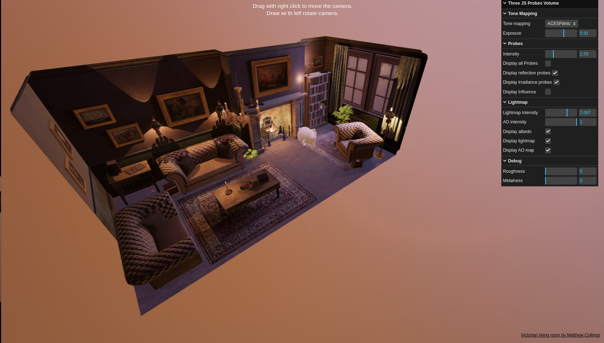
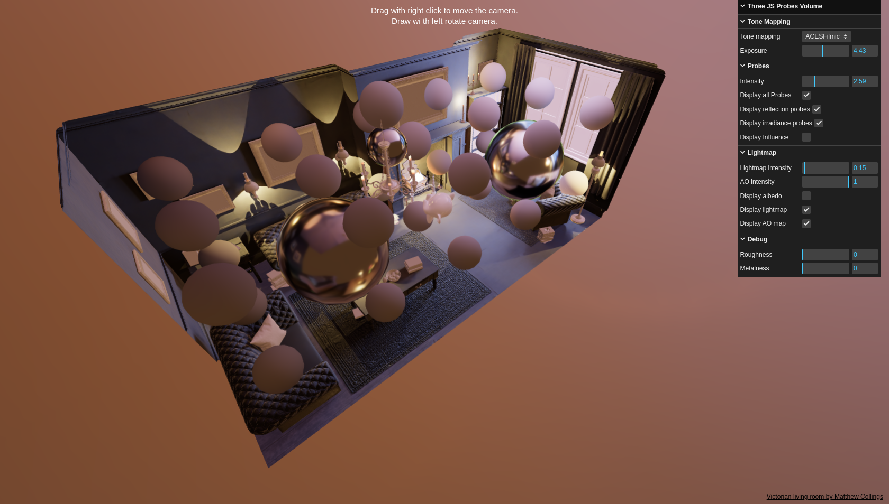

# Three JS baked probes

This project is an extension of existing three js feature with probes support and easy lightmap render group integration . The goal is to be able to have robust probes volumes in three js that can be used for static lighting. 

It is inspired by Blender eevee probes volumes and it is made to be integrated with [a blender plugin] (coming soon on blender marker)

Here is technical details on irradiance / radiance computation :
- Irradiance : [https://learnopengl.com/PBR/IBL/Diffuse-irradiance](https://learnopengl.com/PBR/IBL/Diffuse-irradiance)
- Specular : [https://learnopengl.com/PBR/IBL/Specular-IBL](https://learnopengl.com/PBR/IBL/Specular-IBL)

## Demo




Demo available at [https://three-probes.dotify.eu/](https://three-probes.dotify.eu/)

Demo is based on blender scene provided here [./apps/probes-simpledemo/assets/baking-probs.blend](./apps/probes-simpledemo/assets/baking-probs.blend). 


## Features

### Probes volumes

Replacement of existing environment map by a set of probes.

**Probes Type**
- Irradiance probe grid
- Radiance probe volume with prebaked multi roughness cubemap

**Probe mode**
- Nearest : get nearest probe
- Fragment interpolation (Vertex irradiance interpolation coming soon)

**Probes format**
- PNG : 8 / 16 uint color depth
- EXR : half float / float 

### Lightmap

No spécific lightmap specifig integration, only a bake data loading integration (more info on plugin doc comming)

### visibility collection | layers

As three JS doesn't support a light group system, a light group split system is integrated. in bake loader, which take visibility collection and generate a list of Groups with all light / object combinaison based on light layers mask and object layer mask. 


## Three JS integration

For now it is made as an external app based on three js. The ultimate goal is to integrate it with three js as a plugin.

Notes of what is different from three js :

- [x]!Specular / irradiance cubemap is not separated in three JS
- [x]!Three JS probes extends light class, this lib has its own light class
- [x]!Some app feature mimic three js features rather than using three js classes, some refactoring is needed

### Materials extension

for now probes are not fully integrated in threejs render pipeline. It use extended version of three js based materials : standard, physical, lambert and phong.

Material shader are extended by overriding envmaps (USE_ENVMAP) and by replacing some shadershunks include ([more details](./libs/probes/src/materials/shader/)) with custom (prefixed by probes_*). Material classes are extended using a factory which update shader source and add extra uniforms properties.

```ts
// eg for standard
export class MeshProbeStandardMaterial extends extendProbesMaterial<MeshStandardMaterial>(
  MeshStandardMaterial
) {
}
```

! they are not really well optimized for now as they need to trick the renderer by faking shader material behaviour and force pushing all uniforms if an object move


### In engine baking

In engine baking is not supported for now. The main focus for now is the integration with the coming blender plugin

- [ ]: Allow the blender to export only data (for now you need to bake probes in blender)
- [ ]: Implement a probe render based on cubemap renderer
- [ ]: Implement a probe packer which compute irradiance and radiance (blender version should be easy to port)
- [ ]: Improve cubemap wrapper : now it use cubemap renderer a simple postprocess should be enough


### Probes handler

A probe handler independant from the scene allow to get object surrounding probes and interpolate probes data. Ideally they should have to be fully integrated to the scene (like background) in for material to get the context before rendering.

### Current limitations

- Doesn't support instanced mesh : as only cubemap are supported, instanced rendering is not supported. Maybe SH for irradiance + pano texturearray for radiance looks like a viable solution.
- Volume bounds resolution is resolved using brute force : Octree implementation should be better
- No parrallax support : blender probes has already have the options


## How to build / run the project

This is typescript project, it use lerna to manage multiple packages.

```bash

# build all in repo root directory
yarn
yarn build:dev

# dev app
cd ./apps/app-name #eg. probes-simpledem
yarn serve
# or
yarn build:dev
```


### Roadmap

- [x] Volumes structure and scene integration
- [x] Probes interpolation with objects
- [x] Preview debug tools
- [x] Global probes
- [x] HDR Support
- [x] Three js materials extension
- [ ] Optimisation, class renames, code cleaning
- [ ] Integration test with three js framework
- [ ] Dead probes detection & or occlusion between probes
- [ ] integration with other baking method ( based on blender baking tools )
- [ ] Three JS baking tools (for now is based on blender plugin exported data)