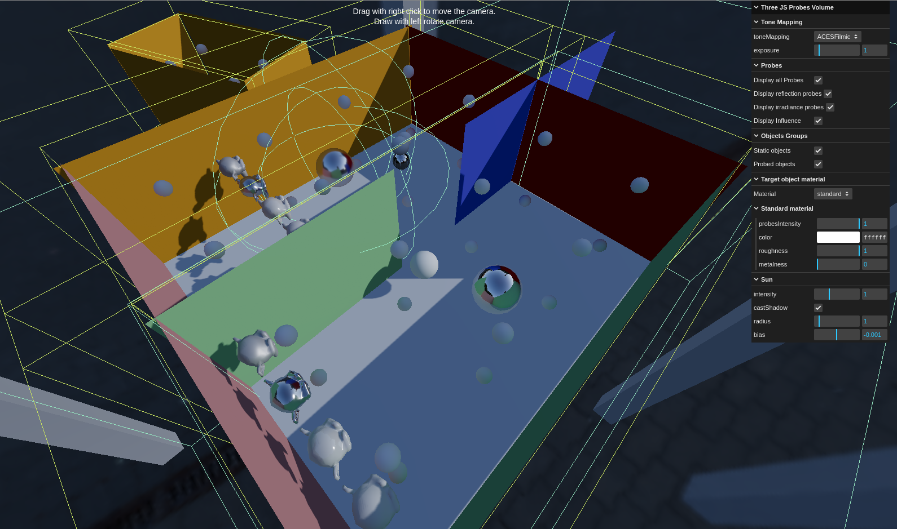

# Three JS probes volumes

This project is an implementation test of probes volumes in three js. The goal is to be able to have robust probes volumes in three js that can be used for static lighting. 

It is inspired by Blender eevee probes volumes and it is made to be integrated with [this blender plugin](https://github.com/gillesboisson/blender-probes-export). This plugin allow to bake irradiance and radiance volumes as usable data for realtime 3D engine.

Here is technical details on irradiance / radiance computation :
- Irradiance : [https://learnopengl.com/PBR/IBL/Diffuse-irradiance](https://learnopengl.com/PBR/IBL/Diffuse-irradiance)
- Specular : [https://learnopengl.com/PBR/IBL/Specular-IBL](https://learnopengl.com/PBR/IBL/Specular-IBL)

More details in [plugin documentation](https://github.com/gillesboisson/blender-probes-export)

## Demo



Demo available at [https://three-probes.dotify.eu/](https://three-probes.dotify.eu/)

Demo is based on blender scene provided here [./apps/probes-simpledemo/assets/baking-probs.blend](./apps/probes-simpledemo/assets/baking-probs.blend). 


## Features

- [ ] radiance cubemaps volume
  - [x] box area
  - [x] sphere area
  - [ ] parallax correction

- [ ] irradiance cubemaps volume
  - [x] grid volume
  - [ ] detect dead probes or occlusion between probes
  - [ ] other volume shapes TBD


- [x] volume data structure
  - [x] global environment as fallback
  - [x] cubemap based probes
  - [x] irradiance based probes
  - [x] volumes bounds solver (brute force)
  - [x] volume interpolation
  

- [ ] baking
  - [x] data schema based on blender plugin (details [blender plugin on doc](https://github.com/gillesboisson/blender-probes-export))
  - [x] data loader 
  - [x] SDR texture wrapper
  - [x] HDR texture wrapper
  - [ ] three js baking tools (based on data schema)

- [x] material
  - [x] shader helper
  - [x] standard material extension
  - [x] physical material extension
  - [x] phong material extension
  - [x] lamber material extension
  

- [ ] others
  - [x] debugging tools


## Three JS integration

For now it is made as an external app based on three js. The ultimate goal is to integrate it with three js as a plugin.

Notes of what is different from three js :

- [x]!Specular / irradiance cubemap is not separated in three JS
- [x]!Three JS probes extends light class, this lib has its own light class
- [x]!Some app feature mimic three js features rather than using three js classes, some refactoring is needed

### Materials extension

for now probes are not fully integrated in threejs render pipeline. It use extended version of three js based materials : standard, physical, lambert and phong.

Material shader are extended by overriding envmaps (USE_ENVMAP) and by replacing some shadershunks include ([more details](./libs/probes/src/materials/shader/)) with custom (prefixed by probes_*). Material classes are extended using a factory which update shader source and add extra uniforms properties.

```ts
// eg for standard
export class MeshProbeStandardMaterial extends extendProbesMaterial<MeshStandardMaterial>(
  MeshStandardMaterial
) {
}
```

! they are not really well optimized for now as they need to trick the renderer by faking shader material behaviour and force pushing all uniforms if an object move


### In engine baking

In engine baking is not supported for now. Blender exported data provided enough data (like probe visibility and cam clipping plane) to be able to bake probes in engine.

- [ ]: Allow the blender to export only data (for now you need to bake probes in blender)
- [ ]: Implement a probe render based on cubemap renderer
- [ ]: Implement a probe packer which compute irradiance and radiance (blender version should be easy to port)
- [ ]: Improve cubemap wrapper : now it use cubemap renderer a simple postprocess should be enough


### Probes handler

A probe handler independant from the scene allow to get object surrounding probes and interpolate probes data. Ideally they should have to be fully integrated to the scene (like background) in for material to get the context before rendering.

### Current limitations

- Doesn't support instanced mesh : as only cubemap are supported, instanced rendering is not supported. Maybe SH for irradiance + pano texturearray for radiance looks like a viable solution.
- Volume bounds resolution is resolved using brute force : Octree implementation should be better
- No parrallax support : blender probes has already have the options


## How to build / run the project

This is typescript project, it use lerna to manage multiple packages.

```bash

# build all in repo root directory
yarn
yarn build:dev

# dev app
cd ./apps/app-name #eg. probes-simpledem
yarn serve
# or
yarn build:dev
```


### Roadmap

- [x] Volumes structure and scene integration
- [x] Probes interpolation with objects
- [x] Preview debug tools
- [x] Global probes
- [x] HDR Support
- [x] Three js materials extension
- [ ] Optimisation, class renames, code cleaning
- [ ] Integration test with three js framework
- [ ] Dead probes detection & or occlusion between probes
- [ ] integration with other baking method ( based on blender baking tools )
- [ ] Three JS baking tools (for now is based on blender plugin exported data)